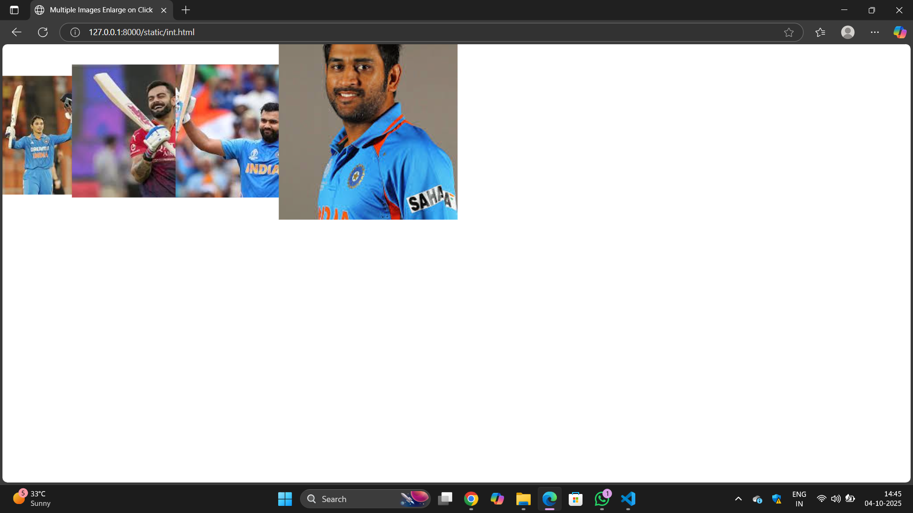

# Ex.08 Design of Interactive Image Gallery
## Date:04/10/2025
## Name:Tharun S
## Ref No:25007797

## AIM:
To design a web application for an inteactive image gallery with minimum five images.

## DESIGN STEPS:

### Step 1:
Clone the github repository and create Django admin interface.

### Step 2:
Change settings.py file to allow request from all hosts.

### Step 3:
Use CSS for positioning and styling.

### Step 4:
Write JavaScript program for implementing interactivity.

### Step 5:
Validate the HTML and CSS code.

### Step 6:
Publish the website in the given URL.

## PROGRAM :
```
int.html

<!DOCTYPE html>
<html lang="en">
<head>
<meta charset="UTF-8" />
<meta name="viewport" content="width=device-width, initial-scale=1" />
<title>Multiple Images Enlarge on Click</title>
<style>
  .clickable-image {
    width: 150px;
    height: auto;
    margin: 10px;
    cursor: pointer;
    transition: transform 0.3s ease;
  }
  .enlarged {
    transform: scale(2);
    z-index: 10;
    position: relative;
  }
</style>
</head>
<body>


<script>
  const images = document.querySelectorAll('.clickable-image');

  images.forEach(img => {
    img.addEventListener('click', () => {
      img.classList.toggle('enlarged');
    });
  });
</script>

</body>
</html>
```

## OUTPUT:




## RESULT:
The program for designing an interactive image gallery using HTML, CSS and JavaScript is executed successfully.
